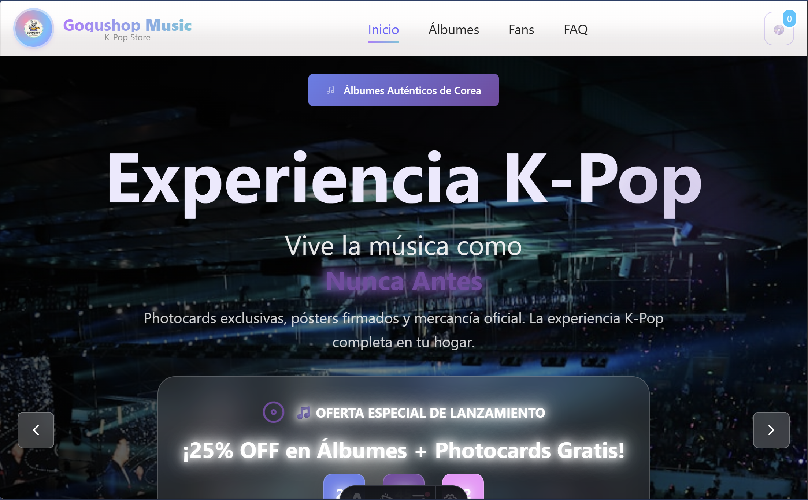
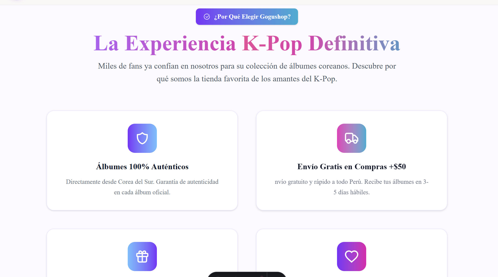
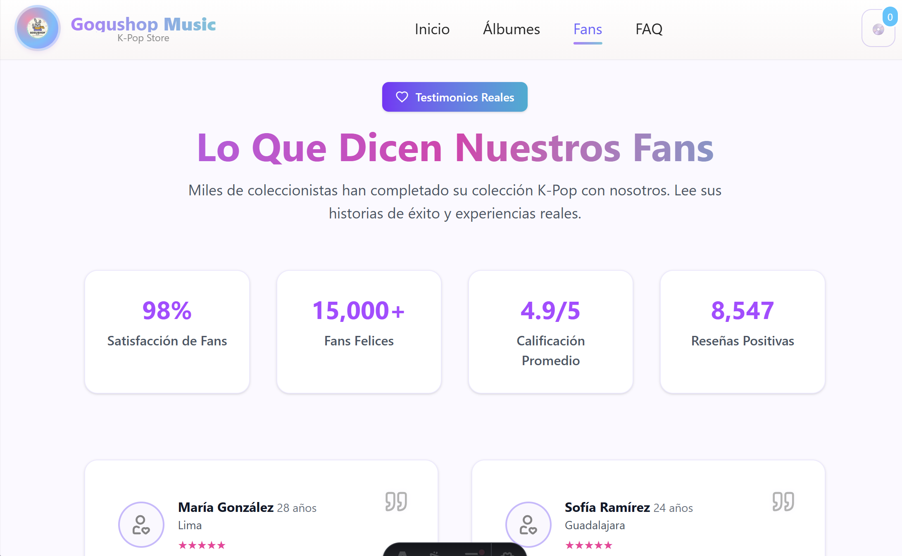
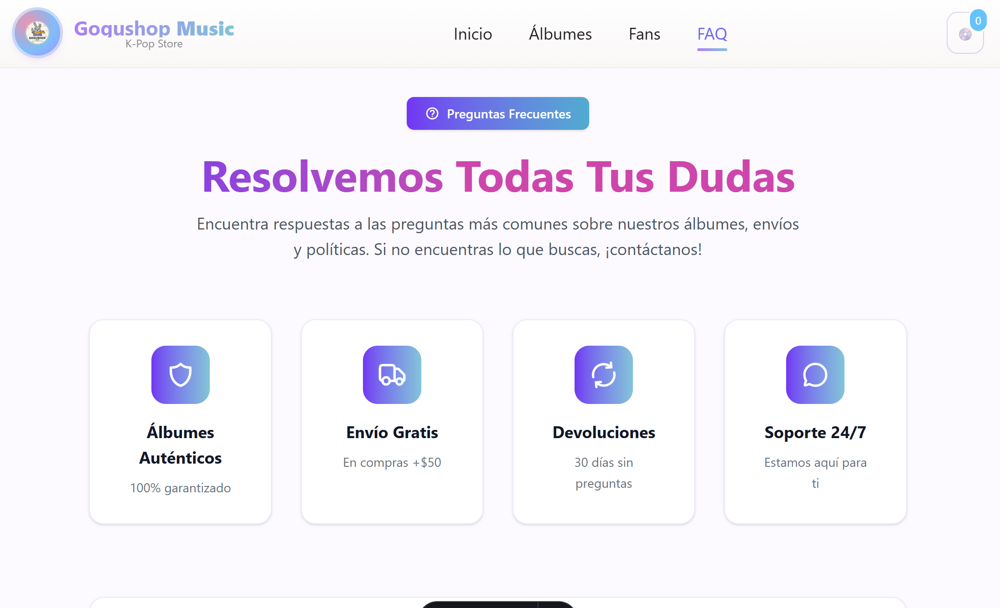
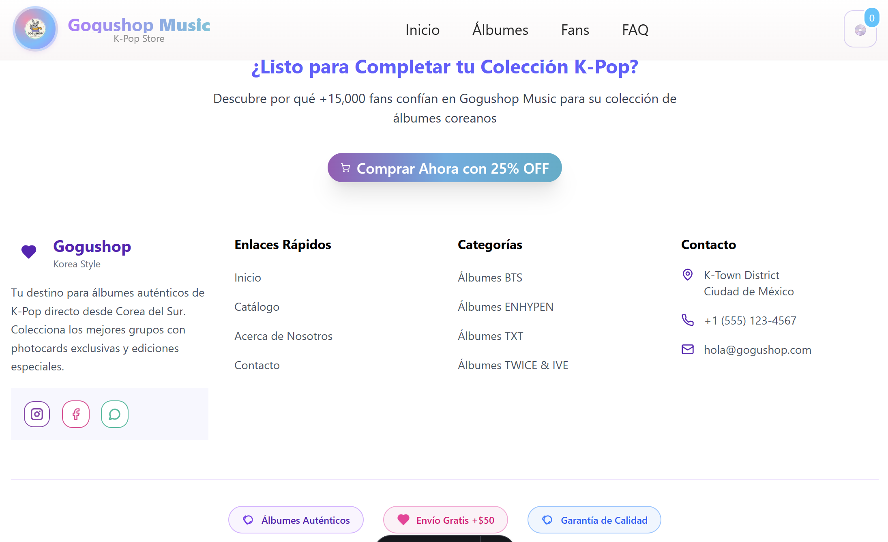

<h1 align="center">🎶 Gogushop Music — Landing Page K-Pop</h1>
<p align="center">
  <i>Una experiencia K-Pop moderna y elegante creada con <b>Astro</b> y <b>Tailwind CSS</b></i>
</p>

<p align="center">
  
  
  
  
  
</p>

---

## 🌸 Descripción General

**Gogushop Music** es una landing page moderna desarrollada con **Astro 5** y **Tailwind CSS 4**, especializada en la venta y exhibición de productos K-Pop, especialmente álbumes musicales 🎧.

### ✨ Características Principales
- 🎨 **Diseño moderno y responsive** con animaciones suaves
- 🚀 **Navegación fluida** entre secciones (smooth scroll)
- 💜 **Temática K-Pop** con colores vibrantes y estilo juvenil
- ⚡ **Optimización de rendimiento** con Astro
- 📱 **Totalmente responsive** para todos los dispositivos

### 🗂️ Secciones Disponibles
> 🏠 **Inicio** • 💿 **Álbumes** • 💜 **Fans** • 💬 **FAQ** • 📞 **Contacto** • ⚡ **Footer**

---

## 🧩 Estructura del Proyecto

```plaintext
📦 app_gogushop/
 ┣ 📂 .astro/              → Archivos de configuración de Astro
 ┣ 📂 public/              → Recursos estáticos (favicon, íconos)
 ┃ ┗ 📂 icons/             → Íconos SVG personalizados
 ┣ 📂 src/
 ┃ ┣ 📂 assets/            → Recursos del proyecto
 ┃ ┣ 📂 components/        → Componentes reutilizables (Navbar, Card, etc.)
 ┃ ┣ 📂 imgs/              → Imágenes del proyecto
 ┃ ┣ 📂 layouts/           → Layout principal (Layout.astro)
 ┃ ┣ 📂 pages/             → Páginas del sitio (index.astro)
 ┃ ┣ 📂 sections/          → Secciones modulares del sitio
 ┃ ┗ 📂 styles/            → Estilos globales y configuración CSS
 ┣ 📜 astro.config.mjs     → Configuración de Astro
 ┣ 📜 tailwind.config.mjs  → Configuración de Tailwind CSS
 ┣ 📜 package.json         → Dependencias y scripts
 ┗ 📜 tsconfig.json        → Configuración de TypeScript
```

---

## 🚀 Requisitos Previos

Antes de comenzar, asegúrate de tener instalado:

- ⚙️ **Node.js** `v18+` (recomendado v20+)
- 📦 **pnpm** `v8+` (gestor de paquetes recomendado)
- 🌐 **Navegador web moderno** (Chrome, Firefox, Safari, Edge)

---

## 💻 Instalación y Configuración

### 1️⃣ Clonar y Navegar al Proyecto
```bash
# Navegar al directorio del proyecto
cd "d:\Voluntariado C-Proyectos\Proyect_Web\app_gogushop"

# Instalar dependencias
pnpm install
```

### 2️⃣ Modo Desarrollo
```bash
# Iniciar servidor de desarrollo
pnpm run dev
```

🌐 **Servidor local:** http://localhost:4321

### 3️⃣ Scripts Disponibles

| Comando | Descripción |
|---------|-------------|
| `pnpm run dev` | Inicia el servidor de desarrollo |
| `pnpm run build` | Construye la versión de producción |
| `pnpm run preview` | Previsualiza el build optimizado |
| `pnpm run astro` | Ejecuta comandos de Astro CLI |

### 4️⃣ Navegación Interna

El navbar incluye navegación suave a las siguientes secciones:
- `#inicio` - Página principal
- `#albums` - Catálogo de álbumes
- `#fans` - Testimonios de fans
- `#faq` - Preguntas frecuentes
- `#contact` - Información de contacto
- `#footer` - Pie de página

---

## 🎨 Tecnologías y Dependencias

### 📦 Dependencias Principales

```json
{
  "astro": "^5.14.1",           // Framework principal
  "tailwindcss": "^4.1.14",    // Framework CSS
  "@tailwindcss/vite": "^4.1.14", // Integración con Vite
  "lucide-astro": "^0.545.0",  // Librería de íconos
  "autoprefixer": "^10.4.21"   // Prefijos CSS automáticos
}
```

### ⚙️ Configuración de Tailwind CSS

El proyecto ya incluye Tailwind CSS 4 configurado. La configuración se encuentra en:
- `tailwind.config.mjs` - Configuración principal
- `src/styles/` - Estilos globales y personalizados

### 🎯 Características de Tailwind Implementadas
- ✅ **Responsive Design** - Breakpoints móvil-first
- ✅ **Dark Mode** - Soporte para tema oscuro
- ✅ **Custom Colors** - Paleta de colores K-Pop
- ✅ **Animations** - Transiciones y efectos suaves
- ✅ **Typography** - Tipografías optimizadas

---

## ✨ Componentes y Secciones

### 🏗️ Arquitectura de Componentes

El proyecto utiliza una arquitectura modular con componentes reutilizables:

```astro
// Ejemplo de estructura de componente
---
// Props y lógica del componente
export interface Props {
  title: string;
  description: string;
  icon?: string;
}
---

<!-- Template del componente -->
<div class="component-container">
  <!-- Contenido del componente -->
</div>
```

### 📱 Secciones Principales

#### 💿 **Sección Álbumes**
- 🎯 Catálogo de productos K-Pop
- 🌟 Sistema de valoraciones y reseñas
- 💎 Cards con degradados y efectos visuales
- 🔍 Información detallada de cada álbum

#### 💜 **Sección Fans**
- 👥 Testimonios reales de usuarios
- 📊 Métricas de satisfacción
- 🎉 Llamadas a la acción (CTA)
- ✨ Animaciones y efectos interactivos

#### 💬 **Sección FAQ**
- ❓ Preguntas frecuentes organizadas
- 🎨 Íconos temáticos (Lucide Icons)
- 🔄 Animaciones de apertura/cierre
- 📋 Componente modular `FaqItem.astro`

#### 🗂️ **Navegación**
- 📱 Navbar responsive con menú hamburguesa
- 🎯 Smooth scroll entre secciones
- 🎨 Indicadores visuales de sección activa
- ⚡ Cierre automático en dispositivos móviles

---

## 🛠️ Desarrollo y Personalización

### 🧠 Tips para Desarrolladores

- **Navegación Inteligente**: El navbar incluye navegación interna con cierre automático en móviles
- **Observador de Intersección**: Implementa `IntersectionObserver` para resaltar secciones activas
- **Componentes Modulares**: Todos los componentes están diseñados para ser reutilizables
- **Performance**: Optimizado con lazy loading y code splitting de Astro

### 🎨 Personalización

#### Agregar Nuevos Álbumes
```astro
// En src/sections/ o src/components/
const albums = [
  {
    title: "Nuevo Álbum",
    artist: "Artista K-Pop",
    price: "$25.99",
    image: "/path/to/image.jpg"
  }
];
```

#### Modificar Colores y Estilos
```javascript
// tailwind.config.mjs
module.exports = {
  theme: {
    extend: {
      colors: {
        'kpop-pink': '#FF69B4',
        'kpop-purple': '#8A2BE2'
      }
    }
  }
}
```

### 🚀 Funcionalidades Futuras

- 🛒 **Carrito de Compras** (localStorage/Astro Store)
- 🌍 **Internacionalización** (i18n)
- 🔐 **Autenticación de Usuarios**
- 💳 **Integración de Pagos**
- 📊 **Analytics y Métricas**

---

## 💖 Stack Tecnológico

| Tecnología | Versión | Propósito |
|------------|---------|-----------|
| ⚡ **Astro** | 5.14.1 | Framework principal y SSG |
| 🎨 **Tailwind CSS** | 4.1.14 | Framework CSS y diseño |
| 🎯 **Lucide Icons** | 0.545.0 | Librería de íconos |
| 📦 **pnpm** | Latest | Gestor de dependencias |
| 🔧 **Vite** | Integrado | Bundler y herramientas de desarrollo |
| 📝 **TypeScript** | Configurado | Tipado estático |
| 🎭 **Autoprefixer** | 10.4.21 | Compatibilidad CSS |

### 🌟 Ventajas del Stack Elegido

- **🚀 Rendimiento**: Astro genera sitios estáticos ultra-rápidos
- **🎨 Flexibilidad**: Tailwind CSS permite diseños personalizados
- **📱 Responsive**: Diseño móvil-first automático
- **🔧 DX**: Excelente experiencia de desarrollo
- **⚡ SEO**: Optimización automática para motores de búsqueda

---

## 🌟 Vista Previa del Proyecto

### 📱 Capturas de Pantalla

<details>
<summary>🖼️ Ver todas las capturas</summary>

#### 🏠 Página Principal


#### 💿 Sección de Álbumes


#### 💜 Testimonios de Fans


#### 💬 Preguntas Frecuentes


#### 📞 Contacto


#### 📱 Vista Móvil


</details>

### 🎯 Características Visuales

- ✨ **Animaciones suaves** y transiciones fluidas
- 🎨 **Gradientes vibrantes** con temática K-Pop
- 📱 **Diseño responsive** optimizado para todos los dispositivos
- 🌈 **Paleta de colores** inspirada en la estética K-Pop
- 🎭 **Íconos modernos** con Lucide Icons

---

## 👥 Equipo de Desarrollo

<table>
<tr>
<td align="center">
<strong>👨💻 Darwin Joel</strong><br>
<sub>Estudiante de Ingeniería de Sistemas e Informática</sub><br>
<em>Frontend Developer & UI/UX</em>
</td>
<td align="center">
<strong>👨💻 Adrian Enrique</strong><br>
<sub>Estudiante de Ingeniería de Software</sub><br>
<em>Full Stack Developer</em>
</td>
<td align="center">
<strong>👨💻 Oscar Antonio</strong><br>
<sub>Estudiante de Ingeniería de Sistemas e Informática</sub><br>
<em>Backend Developer & DevOps</em>
</td>
</tr>
</table>

---

<p align="center">
<em>"El K-Pop es más que música, es una experiencia — Gogushop la lleva hasta ti."</em>
</p>

## 📄 Licencia

Este proyecto está bajo la **Licencia MIT** - consulta el archivo [LICENSE](LICENSE) para más detalles.

**Proyecto educativo** desarrollado con fines de aprendizaje y práctica profesional.

---

<p align="center">
<strong>Hecho con 💜, ☕ y mucho K-Pop</strong><br>
<sub>Powered by Astro & Tailwind CSS</sub>
</p>

<p align="center">
<a href="#top">⬆️ Volver al inicio</a>
</p>