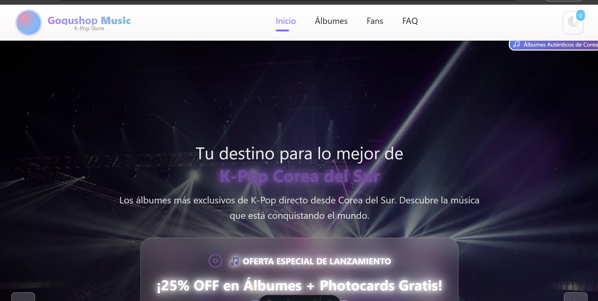
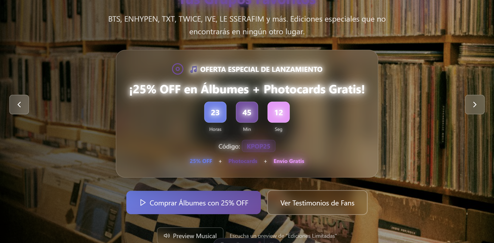
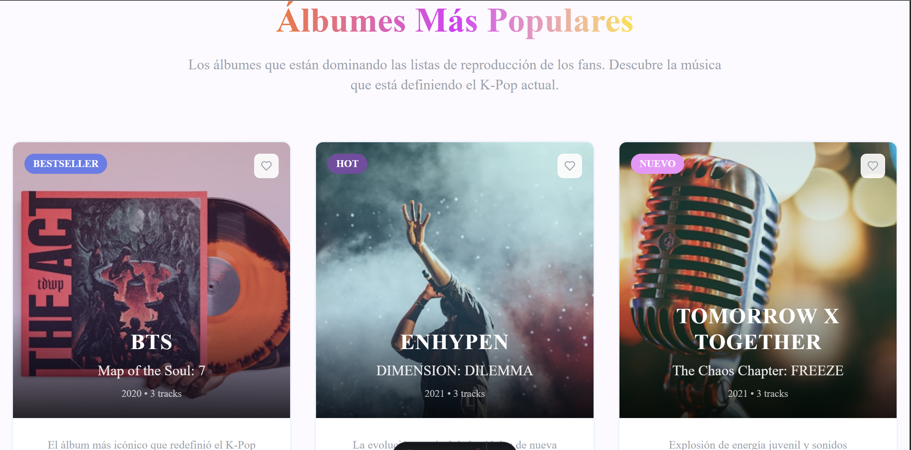
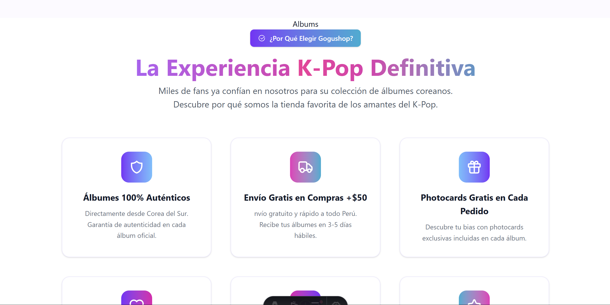

<h1 align="center">🎶 Gogushop Music — Landing Page K-Pop</h1>
<p align="center">
  <i>Una experiencia K-Pop creada con <b>Astro</b> — moderna, fluida y llena de estilo.</i>
</p>

---

<p align="center">
  
  
  
  
  
</p>

---

## 🌸 Descripción General

**Gogushop Music** es una **Landing Page desarrollada con Astro** enfocada en la venta y exhibición de productos coreanos, en especial **álbumes de K-Pop** 🎧.  
Diseñada con un estilo **juvenil, elegante y dinámico**, ofrece una navegación suave entre secciones internas (smooth scroll):

> 🏠 Inicio • 💿 Álbumes • 💜 Fans • 💬 FAQ • 📞 Contacto • ⚡ Footer

💡 _Todo el sitio está optimizado para ser una Single-Page moderna, rápida y con diseño responsive._

---

## 🧩 Estructura del Proyecto

```plaintext
📦 app_gogushop/
 ┣ 📂 public/              → Recursos públicos (favicon, imágenes, íconos)
 ┣ 📂 src/
 ┃ ┣ 📂 components/        → Navbar, Welcome, Card, FaqItem, etc.
 ┃ ┣ 📂 layouts/           → Layout.astro (estructura global)
 ┃ ┣ 📂 pages/             → index.astro (contenido principal)
 ┃ ┗ 📂 styles/            → global.css (estilos + Tailwind opcional)
 ┣ 📜 package.json
 ┣ 📜 tsconfig.json
 ┗ 📜 astro.config.mjs
astro.config.mjs
```
---

## 🚀 **Requisitos Previos**

- ⚙️ **Node.js** `v16+`
- 📦 **pnpm** (recomendado) — aunque también funciona con `npm` o `yarn`

---

## 💻 **Instalación (Windows / PowerShell)**

```bash
cd "d:\Voluntariado C-Proyectos\Proyect_Web\app_gogushop"
pnpm install

🔥 Modo Desarrollo
```

```
pnpm run dev
```

Luego abre 👉 http://localhost:4321

🧭 Navegación interna del Navbar:

#inicio | #albums | #fans | #faq | #contact | #footer
🏗️ Build y Previsualización

```
pnpm run build # Construye versión de producción
pnpm run preview # Previsualiza build optimizada
```

🌈 Integración con Tailwind (opcional pero recomendada)

Instalar dependencias:

```
pnpm install -D tailwindcss postcss autoprefixer
npx tailwindcss init -p
```

Configurar tailwind.config.js:

```
content: ["./src/**/*.{astro,html,js,ts,jsx,tsx}"]
```

En src/styles/global.css añade al inicio:

```
@tailwind base;
@tailwind components;
@tailwind utilities;
```

Reinicia el servidor:

```
pnpm run dev
```

✨ Actualizaciones de Diseño y Nuevos Componentes

### 💿 Sección: Álbumes — Experiencia K-Pop

- 🔹 Seis beneficios visuales que muestran por qué elegir Gogushop.

- 🌟 Sub-sección de reseñas rápidas (valoraciones, fans, años de experiencia).

- 💠 Nuevo componente Card.astro con degradados e íconos SVG coloreables.

### 💜 Sección: Fans — Testimonios Reales

- 💬 Cuatro métricas visuales de satisfacción con testimonios auténticos.

- 🌸 Sub-sección final "Join" con llamado a la acción.

- ✨ Animaciones suaves, textos cursivos y decoraciones con quote.svg.

### 💬 Sección: Preguntas Frecuentes (FAQ)

- ❓ Íconos principales para Álbumes, Envíos, Devoluciones y Soporte.

- 🪄 Componente modular FaqItem.astro con props dinámicas:

```
icon, tag, tagColor, gradient, question, answer
```

- 💫 Animación nativa con addEventListener y rotación del ícono al abrir/cerrar.

⚙️ Integración General en el Layout

```astro
import Albums from "../pages/albums.astro";
import Fans from "../pages/fans.astro";
import Faq from "../pages/faq.astro";

<section id="albums"><Albums /></section>
<section id="fans"><Fans /></section>
<section id="faq"><Faq /></section>

```

- 🧠 Evita renderizar el Navbar dos veces (ya viene desde Layout.astro).

### 🧠 Tips para Desarrollo

- 🧭 El Navbar implementa navegación interna + cierre automático del menú móvil.

- 🔍 Puedes añadir un IntersectionObserver para resaltar la sección activa.

- 🛒 Si deseas integrar un carrito de compras, puedo ayudarte a conectarlo con:

  - localStorage

  - store de Astro o React

  - Backend (API REST / Supabase / Firebase)

### 🛠️ Contribuir / Personalizar

- 🎨 Agrega o edita álbumes desde src/pages/index.astro o src/components/Albums.astro.

- 💬 Mejora secciones, ajusta props y colores directamente desde los componentes.

- 🌍 Si deseas soporte multilenguaje o internacionalización (i18n), puedo ayudarte a configurarlo.

### 💖 Tecnologías Usadas

| Tecnología                                | Uso Principal                |
| ----------------------------------------- | ---------------------------- |
| ⚡ **Astro**                              | Framework base del proyecto  |
| 🎨 **Tailwind CSS**                       | Diseño y estilo responsivo   |
| 💾 **pnpm**                               | Gestor de dependencias       |
| 🧱 **HTML / CSS / JS / Astro Components** | Construcción modular         |
| 🪶 **SVG / Íconos personalizados**        | Estilo y personalidad visual |

🌟 Vista Previa (Conceptual)









## 💫 Autores

👨‍💻 Darwin Joel
Estudiante de Ingenieria de Sistemas e Informática

👨‍💻 Adrian Enrique
Estudiante de Ingenieria de Sistemas e Informática

👨‍💻 Oscar Antonio
Estudiante de Ingenieria de Sistemas e Informática
“El K-Pop es más que música, es una experiencia — Gogushop la lleva hasta ti.”

🧷 Licencia

Proyecto libre para fines educativos y de práctica — Hecho con 💜 y Astro.
